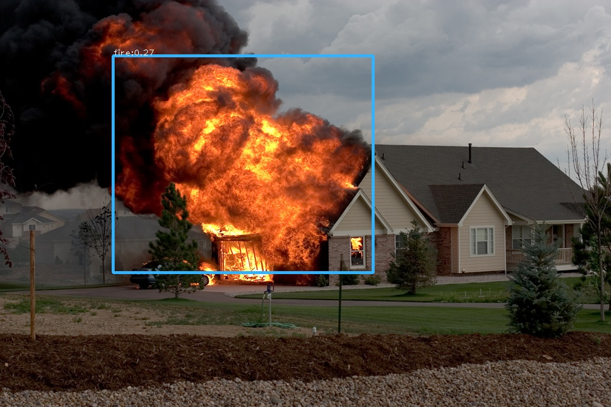

<h1>YoloV3 Fire Detection Model</h1>

 
 

<h3 style="text-decoration: underline;">Dependencies</h3>

<ul>
    <li>Python 3</li>
    <li>Numpy  pip install numpy</li>
</ul>

<h3 style="text-decoration: underline;">Usage</h3>

<h6>Video</h6>

python -v path/to/video 

python --video path/to/video 

 

<h6>Image</h6>

python -i path/to/image 

python --image path/to/image 
